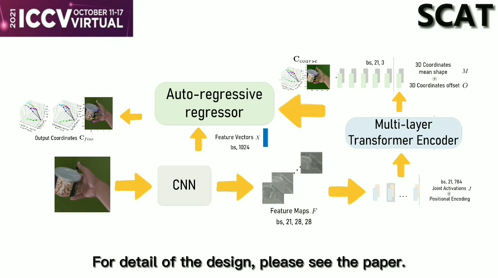

## SCAT: Stride Consistency with Auto-regressive regressor and Transformer for hand pose estimation (ICCVW 2021)

Our approach **SCAT** (Stride Consistency with  Autoregressive regressor and Transformer, SCAT) offers a
new representation for measuring hand poses. The new representation includes a mean shape hand template and its 21
hand joint offsets depicting the 3D distances between the hand template and the hand that needs to be estimated. Besides, SCAT can generate a robust and smooth linear mapping between visual feature maps and the target 3D offsets, ensuring inter-frame smoothness and removing motion
jittering. We also introduce an auto-regressive refinement procedure for iteratively refining the hand pose estimation.
Extensive experiments show that our SCAT can generate more accurate and smoother 3D hand pose estimation results compared with the state-of-the-art methods.

ICCV Workshop 2021 [SOMOF](https://somof.stanford.edu/workshops/iccv21)

[](https://somof.stanford.edu/cgi-bin/public/ICCVSoMoF2021AllFiles/6/Supplementary/Video_Submission6.mp4)


### install

1) `pip install requirements.txt`.

2) download `MANO_RIGHT.pkl` from MANO official website and put it into `extra_data` folder.

3) user need specify their own **STB**, **Ho-3D** and **FreiHand** dataset path and file (`MultiDataset.py`) in `dataset` folder for testing.

### run

```shell
python train.py --hand_choice mano --lr 5e-4 --net reg_transformer --batch_size 96 --epoch 40 --stage 3 --l_weight_3d 100000 --l_weight_2d 10 --checkpoint_folder experiments/ablation/20220728 --pl_reg True --debug_img 20220728 --vit_heads 8 --iteration 3 --pos_embed True --vit_dropout 0.0 --mask_rate 0.2 > debug_logs/20220728.log
```

- mask_rate: masking ratio

- vit_heads: head number

- iteration: iterations

- pos_embed: position embedding

- pl_reg: path length regularization


### update log(start from `2021.02.01`)

- 2021.02.01

① `dataloader`

② `warmup`


- 2021.02.05

① `different backbone`

② `transformer` (PE, random masking mechanism)

- 2021.02.07 **milestone**

① more robustness structure

② blender ---> mean xyz of MANO right hand, let network predict offset term.

